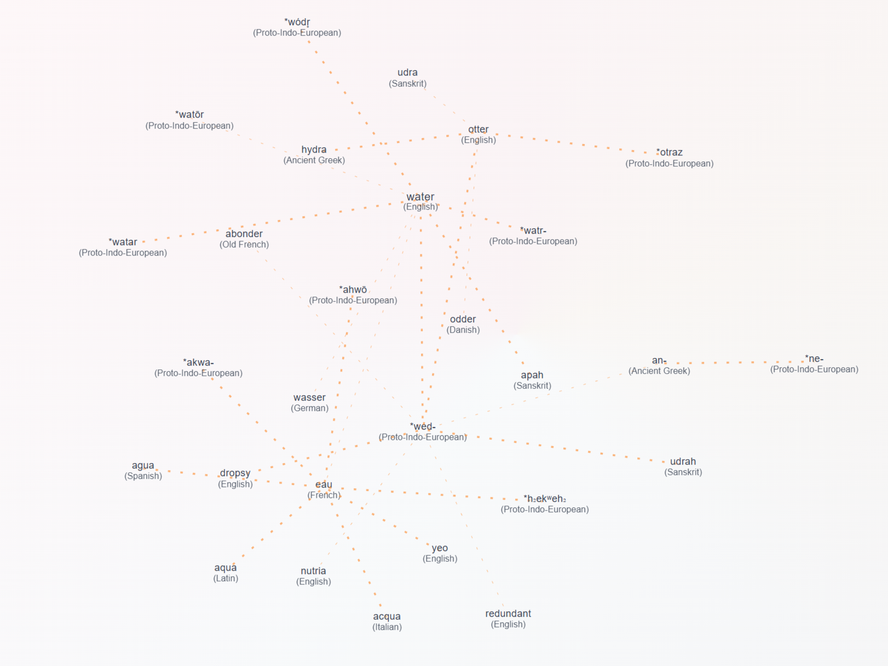

# etmos

  <div align="center">
      <a href="https://etmos.pages.dev" target="_blank">
          
      </a>
      <br>
      <a href="https://etmos.pages.dev" target="_blank">
          <b>https://etmos.pages.dev</b>
      </a>
     </div>
    <br>
    
A visual, interactive graph-based application for exploring etymological connections between words across different languages.

Powered by AI for intelligent extraction of etymological relationships from etymonline.com, providing more accurate and comprehensive word connections! 
 


## Tech Stack

**Frontend:**
- React 19 with TypeScript
- D3.js for graph visualization
- TanStack Query for data fetching
- Vite for build tooling
- Tailwind CSS for styling

**Backend:**
- Fastify server with TypeScript
- Node-cache for response caching
- Deployed on Railway

## Getting Started

### Prerequisites

- Node.js 18+ and npm
- OpenAI API key (for AI-powered etymology extraction)

### Installation

1. Clone the repository:
```bash
git clone https://github.com/jo56/etmos.git
cd etmos
```

2. Install dependencies for all components:
```bash
npm run install:all
```

3. Configure your API keys:

Copy the example environment file:
```bash
cp server/.env.example server/.env
```

Edit `server/.env` and add your OpenAI API key:
```env
# AI Configuration
AI_PROVIDER=openai
AI_API_KEY=your-openai-api-key-here
AI_MODEL=gpt-4o-mini

# Server Configuration
PORT=54330
FRONTEND_URL=http://localhost:5173
```

**Getting an OpenAI API Key:**
- Sign up at [OpenAI Platform](https://platform.openai.com/)
- Navigate to [API Keys](https://platform.openai.com/api-keys)
- Create a new secret key
- Add credits to your account (pay-as-you-go)

**Cost Estimate:** Using `gpt-4o-mini` (default), typical etymology extraction costs ~$0.01-0.02 per 100 words searched.

### Development

Start both frontend and backend development servers:
```bash
npm run dev
```

This will start:
- Backend API server on `http://localhost:54330`
- Frontend application on `http://localhost:5173`

Both will automatically reload when you make changes to the code.

### Running Client or Server Individually

```bash
# Run only the frontend in development mode
npm run client:dev

# Run only the backend in development mode
npm run server:dev
```

## Production

### Building for Production

Build both frontend and backend:
```bash
# Build the client (creates optimized bundle in client/dist)
npm run client:build

# Build the server (compiles TypeScript to server/dist)
npm run server:build
```

### Running Production Builds

Start the production server:
```bash
npm run server:start:prod
```

Preview the frontend production build locally:
```bash
cd client
npm run build
npm run preview  # Serves on http://localhost:4173
```

## How It Works

### AI-Powered Etymology Extraction

Unlike traditional regex-based parsing, etmos uses AI to understand the semantic context of etymological text from etymonline.com:

1. **Scraping**: Fetches etymology data from etymonline.com
2. **AI Processing**: Sends cleaned HTML to OpenAI with expert prompts
3. **Smart Extraction**: AI identifies:
   - Proto-Indo-European roots (PIE)
   - Ancient language forms (Latin, Greek, Sanskrit, etc.)
   - Historical language stages (Old English, Middle French, etc.)
   - Cognates and related words
   - Borrowings and derivatives
4. **Graph Building**: Connections are visualized in an interactive graph
5. **Priority Ranking**: Etymonline (AI-powered) → Wiktionary → Dictionary API

### Data Sources Priority

1. **Etymonline.com** (Primary - AI-powered) - Highest quality etymological data
2. **Wiktionary** (Secondary) - Community-contributed etymology
3. **Dictionary API** (Tertiary) - Basic word origins

## Usage

1. **Search**: Enter a word in the search bar to create an initial graph
2. **Expand**: Click on any node to reveal its etymological connections
3. **Settings**: Click the settings icon (top-left) or press `Shift` to toggle the settings panel
4. **Themes**: Choose from 12 different visual themes in the settings panel
5. **Max Neighbors**: Adjust the maximum number of connections shown per node (1-50)

## API Endpoints

The backend provides the following endpoints:

- `GET /api/etymology/search?word={word}&language={lang}` - Search for a word's etymology
- `POST /api/etymology/initial` - Get initial graph data for a word
- `POST /api/etymology/neighbors` - Get neighbors for a specific node
- `GET /api/health` - Health check endpoint

## Environment Variables

Create a `server/.env` file in the server directory:

```env
# AI Configuration
AI_PROVIDER=openai
AI_API_KEY=your-openai-api-key-here
AI_MODEL=gpt-4o-mini

# Server Configuration
PORT=54330
FRONTEND_URL=http://localhost:5173
NODE_ENV=development
```

### AI Configuration Options

- `AI_PROVIDER`: Choose AI provider (currently supports: `openai`)
- `AI_API_KEY`: Your OpenAI API key
- `AI_MODEL`: Model selection (affects cost and quality)
  - Options: `gpt-4o`, `gpt-4o-mini` (recommended), `gpt-4-turbo`

## Troubleshooting

### "AI service not available" errors

**Problem:** Backend can't access OpenAI API

**Solutions:**
1. Verify `server/.env` file exists in server directory
2. Check `AI_API_KEY` is set correctly in `server/.env`
3. Ensure you have credits in your OpenAI account
4. Restart the development server after changing `.env`

### No etymology data appearing

**Possible causes:**
1. No API key configured in `server/.env` (check console for warnings)
2. Network issues connecting to etymonline.com
3. Rate limiting from etymonline.com (wait a few minutes)

## License

MIT

